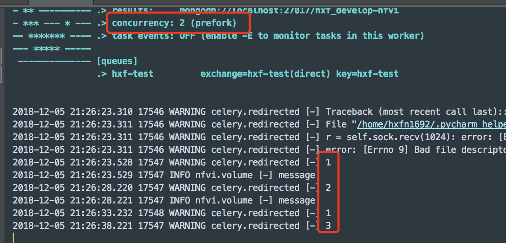

## celery-周期性任务
在celery原有的框架下加入周期性任务，一般有两种方式。
1. 通过函数add_periodic_task(...)
  ```python
  from celery import Celery
  from celery.schedules import crontab
  app = Celery()
  #在 on_after_configure 句柄上设置这些意味着当使用test.s() 时我们不会在模块级别对 app 求值。
  @app.on_after_configure.connect
  def setup_periodic_tasks(sender, **kwargs):
      # Calls test('hello') every 10 seconds.
      sender.add_periodic_task(10.0, test.s('hello'), name='add every 10')

      # Calls test('world') every 30 seconds
      sender.add_periodic_task(30.0, test.s('world'), expires=10)

      # Executes every Monday morning at 7:30 a.m.
      sender.add_periodic_task(
          crontab(hour=7, minute=30, day_of_week=1),
          test.s('Happy Mondays!'),
      )

  @app.task
  def test(arg):
      print(arg)
  ```
  追溯回`add_periodic_task()`函数。我们传入的参数包括schedule(执行的频率)，函数及其参数，设置name等其他参数。也可以指定任务的队列。
  ```python
  def add_periodic_task(self, schedule, sig,
                      args=(), kwargs=(), name=None, **opts):
    key, entry = self._sig_to_periodic_task_entry(
        schedule, sig, args, kwargs, name, **opts)
    if self.configured:
        self._add_periodic_task(key, entry)
    else:
        self._pending_periodic_tasks.append((key, entry))
    return key
  ```

2. CELERYBEAT_SCHEDULE中实现routing。相当于把调度任务写在配置文件中。
```python
app.conf.beat_schedule = {
    'add-every-30-seconds': {
        'task': 'tasks.add',
        'schedule': 30.0,
        'args': (16, 16)
    },
}
app.conf.timezone = 'UTC'
```

## Beat
celery beat 是一个调度器；它以常规的时间间隔开启任务，任务将会某个可用节点上运行。默认情况下，入口项是从 beat_schedule 设置中获取(参考上述的方式2)。
当我们执行周期任务的时候需要用以下命令来启动调度器。我们要独立运行beat这个进程，持续监听。然后定时将任务发送，让worker执行。
```
celery worker -A periodic_task
celery beat -A periodic_task
```
或者在worker运行的时候传入参数`-B`。
 this is convenient if you’ll never run more than one worker node, but it’s not commonly used and for that reason isn’t recommended for production use.
```
celery worker -A periodic_task -B
```

## crontab
当我们对执行任务的频率有更精细的控制时，例如，要在一天中某个特殊时间或者一周中某天，可以使用crontab调度器类型。Crontab 表达式的语法非常灵活。下面是总结的一个表格，可以根据自己的需求写crontab调度器。

|Example	|Meaning|
|--|--|
|crontab()	|每分钟执行|
|crontab(minute=0, hour=0)|	每天凌晨执行|
|crontab(minute=0, hour=’*/3’)|	每三个小时执行: midnight, 3am, 6am, 9am, noon, 3pm, 6pm, 9pm.|
|crontab(minute=0,hour=’0,3,6,9,12,15,18,21’)	|同上|
|crontab(minute=’*/15’)	|每十五分钟执行|
|crontab(day_of_week=’sunday’)|	星期天每分钟执行|
可以通过改变参数来实现更加复杂的控制。

## 任务重叠
你必须保证一个调度一次只被一个调度器运行，否则将会形成重复任务。
但是当两个任务的执行时间发生重叠，当下一个定时任务来临时，当前任务还没有执行完，可能会带来一些异常。
### 相关方案
我找了网上实现周期性任务重叠执行的问题，以及现有的一些相关方案。
-  使用 Redis 实现了分布式锁。
  - http://loose-bits.com/2010/10/distributed-task-locking-in-celery.html
  - Distributed Locks with Redis
-  使用celery_once。
  - Celery Once也是利用 Redis 加锁来实现，他的使用非常简单。在 Task 类基础上实现了 QueueOnce 类，该类提供了任务去重的功能，所以在使用时，我们自己实现的方法需要将 QueueOnce 设置为 base
  - https://pypi.org/project/celery_once/


### 关于这个问题的一些相关讨论
https://stackoverflow.com/questions/4095940/running-unique-tasks-with-celery

https://github.com/celery/celery/issues/251

https://stackoverflow.com/questions/20894771/celery-beat-limit-to-single-task-instance-at-a-time

### 遇到的一个问题
- **问题描述**：用全局flag变量来实现简单的锁操作的时候发现一个问题：多个周期任务中修改全局变量时不生效。
- **问题发现**：因为设置的进程数太多了（10），这个global变量其实是在生效的。只不过是每一个进程级别的生效。每一个进程都是在时间周期到了之后，相互争抢job，所以本次进程在下一次不一定就竞争成功，所以看上去全局变量没有刷新。concurrency:2 (prefork)，这些线程应该在拉起时就创建好的

- **解决方案**：需要使用进程级别的共享变量（例如：丢到数据库或者所有并发进程共享变量例如：app这变量）。
