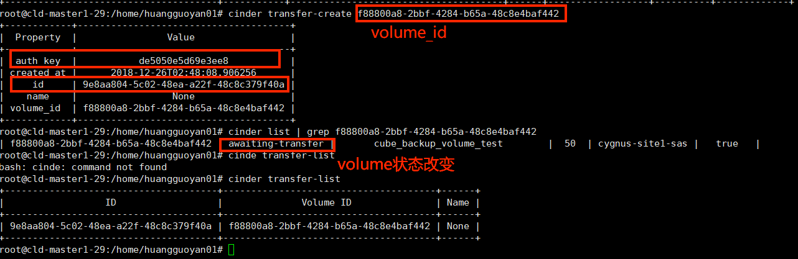

问题相关issue参考：scheduler/cld-api-server#79
nfvi备盘池issue参考：scheduler/cld-api-server#134
## 背景描述
目前提供虚机的流程是：
  - 基于 cinder snapshot 创建一个系统盘
  - 创建 swap，data 盘
  - 将以上三块盘通过 device-mapping 挂进去

创建cinder volume的时候可能会因为cinder的配置`rbd_flatten_volume_from_snapshot=True`导致创盘很慢，或者进程挂掉，影响了整个虚机创建的过程。为了加速这个过程，可以先提前预备好一批available的sys盘，到时创建请求来了之后，直接在备盘池中选择一个备盘即可，然后拉起server即可。这样子整个过程会比较快速。

我们可以参考之前在nfvi实现备盘池的方案scheduler/cld-api-server#134，做一定的修改，移植到cube中。

## 方案简述
  - 新增volume-worker，使用beat来执行celery的周期任务。
    - def backup_volume()
      - step1: 身份认证，获取token，tenant id
      - step2：从配置文件中获取备盘的配置信息.这里我们根据type(sas. ssd)以及os_name(windows，debians)来创建不同的盘。
      - step3: 检查数据库backup_volumes，看这次备盘操作,哪几种类型的盘需要备，需要备多少个。用两个参数来过滤计数(snapshot_type, status)
      - step4: 获取备盘的两个参数volume_type和snapshot_id。通过cinder list以及os表来查询。
      - step5：create_volume(cld_api, vol_data), 通过post请求Cinder API，创盘
      - step6: 将创盘的记录加入到数据库中
        - 根据返回值中的volume_id，查询数据库是否有条目
        - 如果有，就更新相关的信息。name, status, allocated
        - 如果没有，创建一条新的条目。id, name, type, snapshot, allocated

    - check_volume_state
      - 检查状态为creating的所有volume状态变化。获取所有状态为creating的volume的volume_id
      - 查询volume在cinder中的状态
        - 如果为available，更新本地的数据库表volume的状态
        - 如果为creating，说明还没创建完，下次还需查看这个volume的状态
        - 如果为其他状态，一律删除本地数据库中对应的volume条目。
  - 原来创建server的流程修改
    - 在`create_volume_if_absent`中，添加从备盘池选择的逻辑，根据volume_type和os_name从备盘池中选择有效的备盘，并且将备盘池中的数据删除。当备盘池空的时候，我们走原来的创建流程。

    **create_volume_if_absent**
    - 非系统盘走原来的流程。
    - 如果是系统盘：
      从cinder list中根据volume_name来获取这个volume(GET请求)
        - 如果存在，不用创建，直接返回volume_id
        - 如果不存在，则查询备盘池表
            - 如果有多余的备盘，进行备盘转移cinder_transfer、cinder_accept，返回volume_id
            - 如果没有多余的备盘，调用create_volume(...)方法来创盘，返回volume_id

    - 维护镜像的时候，需要`sync_os`。需要将备盘数据清空。这个时候应该将volume_pool的容器停掉，以免备盘时用了旧的镜像。
   - 删除server的流程无需改变

## 数据库设计

|属性|含义|备注|
|---|---|---|
|id   |自增id   |   |
|volume_id   |volume的UUID，与cinder中的volume id相同  |   |
|type   |volume_type，与cinder中的volume type相同   | ssd/ sas  |
|snapshot_id   |对应的snapshot_id   |   |
| **os**  |**os类型**   | **新增的**  |
|status   |volume状态   | creating/available  |
|created_at   |创建时间   |   |
|updated_at   |更新时间  |   |

## 问题讨论
### 问题讨论1：如何获取snapshot_id
正常逻辑中获取snapshot_id

```
def get_os_by_name(cls, name, ebs_type):
    ebs_type = ebs_type.lower()
    _os = None
    if name:
        _os = current_session.query(Os).filter_by(name=name, type=ebs_type).first()
    return _os

if _os and _os.snapshot_id:
    server_args['snapshot_id'] = _os.snapshot_id
```

创盘需要的信息json格式，如何获取volume_type。首先是通过os表查询对应的volume-id，然后再通过这个volume_id去查询cinder，看这个volume对应的volume_type，再赋值。
```python
volume_data = {
            "volume": {
                "size": size,
                "multiattach ": False,
                "snapshot_id": snapshot_id,
                "name": "backup_volume",
                "volume_type": volume_type,
                "metadata": {},
            },
        }
```

cinder
 list中volume_type是由ceph池+volume_type组成。

备盘之前要获取snapshot_id, volume_type
#### 方案1
从os表中读取os_name对应的

os表怎么来的呢
sync_os：(由管理员更新镜像后，手动触发)
1. 清空os表
2. 读取cinder的snapshot-list，获取所有的snapshot
3. 根据snapshot的名称进行解析。然后命名规则匹配，是我们要的那个snapshot_id，我们就插入新的数据到os表中。更新os表。

#### 方案2
直接从cinder list中根据命名规则去取最新的volume_id，然后再解析，获取到他的volume_type和snapshot_id，然后发出post请求创盘。

| 方案简述| 优点| 缺点|
|---|---|---|
| 方案1  |简单，方便，直接读取数据库表就可以获取   | 一旦底层的镜像更新，导致备盘池中的备盘用的镜像不是最新的，如果直接删除备盘池，代价很大  |
| 方案2  | 不管管理员是否忘记sync_os，能够保证创建备盘时用的是最新的镜像  | 比较麻烦  |

缺点：可能备盘使用了旧的镜像，这样会与数据库os的不一致。->影响是什么？(镜像不一致)

需要备盘的镜像不存在怎么办
- os表无法获取，但cinder list可以获取
- os表、cinder list无法获取(无法备盘)


### 问题讨论2：project归属问题
备盘有一个比较大的差异就在于create 虚机的volume的时候需要做一层volume transfer
#### 问题描述


cube 创建备盘的时候会指定project，我们在test项目下创建备盘，但是在admin项目下看不到这些备盘。需要用到cinder transfer这个接口，转移cinder volume的归属权。

#### transfer的基本用法



#### 使用
- 发出volume transfer的应该是tenant用户为admin的用户。而且我们的备盘也是由admin来创建，放在admin项目下。这样让所有的备盘都可见。
- 发出volume accept的应该是请求的用户，比如说test, h42等等。

### 问题讨论3：token获取
在cube项目中，token是通过hawkeye的token验证，再由它向keystone去请求一个token。而在nfvi项目中，可以尝试通过project, user, password三个值直接与keystone交互，然后获得token。

### 问题讨论4：需要添加router
使用新的url请求
```
url = "os-volume-transfer"
        transfer_data = {
            "transfer":{
                "volume_id": volume_id,
                "name":"first volume",
            }
        }
result = admin_cld_api.post(CINDER, url, transfer_data)
```
需要修改`router`中的`services.json`,添加`os-volume-transfer`对应的端口。
### 问题讨论5： 备盘的间隔，备盘数量，备盘os

上图是线上环境-麒麟座的统计数据，可以看到debian8, debian9使用量比较多，其他的使用量比较少。我们可以分成两类备盘的数量。
一般来说，我们在cube的创建时间间隔会比nfvi中长，因此我们用两倍的时间。比如说在nfvi中需要等待20s，在cube中等待40s。

### 数据库修改
新增数据库backup_volumes。相关的数据库更新文件在`cld-api-server\misc\20181221_change.sql`.
```
USE cld_api_server_bj_cube_test;

CREATE TABLE backup_volumes (
    id INT NOT NULL AUTO_INCREMENT ,
    volume_id       VARCHAR (64),
    name            VARCHAR (64),
    type            VARCHAR (64),
    status          VARCHAR (64),
    snapshot_id     VARCHAR (64),
    os              VARCHAR(64),
    create_at       TIMESTAMP DEFAULT CURRENT_TIMESTAMP,
    modify_at       TIMESTAMP DEFAULT CURRENT_TIMESTAMP ON UPDATE CURRENT_TIMESTAMP,
    PRIMARY KEY (id)
);
```
### 配置文件新增项
```
[DEFAULT]
...
volume_queue=volume_queue

[cld]
real_keystone_url_1=http://10.110.81.246:35357/v2.0

[volumes]
concurrency=2

[volumes_backup]
volume_backup_types=sas
volume_backup_os_more=Debian8 64bit, Debian9 64bit
volume_backup_os_less=Freebsd9.3 64bit,Ubuntu16.04 64bit,Centos6.8 64bit,Centos7.3 64bit,Debians8.9 64bit,Freebsd10.3 64bit,Freebsd11.2 64bit,Windows2012 64bit,Windows2016 64bit
backup_nums_more=10
backup_nums_less=2
backup_frequency_minute = 20
check_state_frequency_minute = 5
create_volume_time_interval_second=40

[auth_args]
auth_project=admin
auth_user=admin
auth_passwd=admin
```

### 启动备盘池进程

### 自测文档
配置
备盘周期为20分钟，频繁的备盘备10个，不频繁的备盘备2个。
测试用例设计

|测试操作|结果|
|--|--|--|--|
|将backup_volumes数据库表清空，模拟首次备盘|数据库表新增数据，根据配置文件创建volume|
|备盘池的volume已经满足了预期需求且无人使用备盘，再次备盘|数据库表中不会新增数据，备盘池无变化|
|有人使用了备盘，再次备盘。|数据库表新增数据，新建备盘，补充备盘池|
|check_volume_state：检查所有数据库中状态为creating的volume的状态变化|数据库表会更新volume状态，如果不是creating，available就从数据库中删除 |
|周期任务执行，看运行的时间是否符合预期，这里频率使用默认值。|每10分钟执行backup_volume任务，每5分钟执行check_volume_state任务 |
|周期任务重叠|将备盘的周期调小，判断为同一个周期任务则不执行|
|创建vnfp的时候备盘的volume不足时|创建vnfp成功，正常的创建顺序，需要等待创盘时间|
|创建server的时候备盘的volume足够|创建server成功，无需等待创系统盘时间。创建server的时候选择备盘，对备盘进行转移，从admin项目转移至指定项目，并对备盘进行修改名称，并且从数据库表中删除该条目。|
|删除对应的server|需要先shutdown这个server，然后发起删除server请求，删除成功，流程无改变，对应的volume也会被删除|
|修改配置文件中的参数，看是否生效|对应不同的参数设置，备盘频率，备盘个数等等，看实际备盘的动作，与配置文件一致|


1. 清空数据库表，准备首次备盘


2. 备盘期间查看数据库变化

在check_volume_state中检查了备盘的状态，可以看到创建成功，并从creaing变成了available的状态。

观察openstack中的状态

看log信息，观察备盘任务

3. 备盘完成


4. 使用备盘创建server


5. 补充备盘

