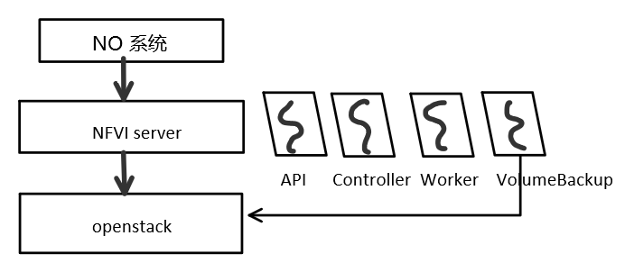

## 理解 NFVI 的功能定位和基本架构
### nfvi server的位置
NO系统 - nfvi server - openstack(nova，cinder，keystone等组件)

这里不直接调用openstack的api接口，而是将请求发送到nfvi server，再转发到openstack。这样一来可以通过NFVI server将NO的请求发送到其他系统中，不限于openstack。
### nfvi的基本架构：
看了nfvi这个项目的代码，有三个主要的进程，分別在三個容器中运行：
- api：daemon进程，接收用户请求
- controller：调度进程。
- worker：工作进程。NfviWorker注册了一些跟vnfp操作相关的task，包括创建、获取、更新、删除vntp。执行代码放在了/command/vnfp.py中的`VnfpCommand`类中。
配置文件在`/home/conf/nfvi/nfvi.conf`下。
日志文件在`/var/log/nfvi/`下。

### 测试nfvi server的api
目前可以登陆到cld-nfvi-1001主机用nfvi的环境。
问题：如何用postman来测试相关的接口？参考另一篇文档

## 考虑如何在 NFVI 系统中实现备盘池
我的后续工作会是将备盘池的功能在NFVI系统中实现。
1. 实现一个daemon进程，执行周期性发送api请求。
  - 考虑定时任务，定时的参数设置可以写在配置文件中；
  - 周期性（每小时检查一次）检查备盘池，如果备盘池中的available volume不够了，创建新的volume补充到规定的数量；
  - 周期性（每12小时对账一次）根据数据库volume id，调用cinder API，更新表中记录的所有volume的信息对账。因为出现diff可能性不大，而且backup_volume表量级也不会太大，所以压力比较轻；
  - daemon进程应该是一个独立于api，controller和worker的进程。我的理解是独立跑在一个容器里面，发起api请求，然后nfvi server接收到相应的请求之后做对应的动作。
2. 设计与定义接口，管理备盘池中的volume资源，包括创建、获取查询等操作
3. 设计与创建数据库表。用数据库表来维护备盘池的资源，这样不用每次都去向openstack查询备盘池的信息。
4. 后续还要修改创建vnfp的相关流程。

## 方案设计

1. 直接让VolumeBackup进程调用openstack的api，创建volume pool。
2. 设计考虑可移植性，后续可以移植到cube上
3. 设计考虑进程的独立性，即使backupVolume进程挂掉了，对其他进程(api，controller，worker)的影响不大
