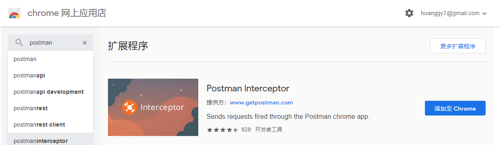
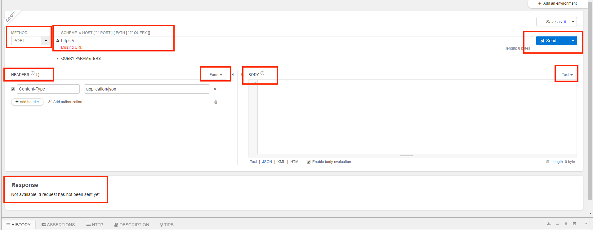
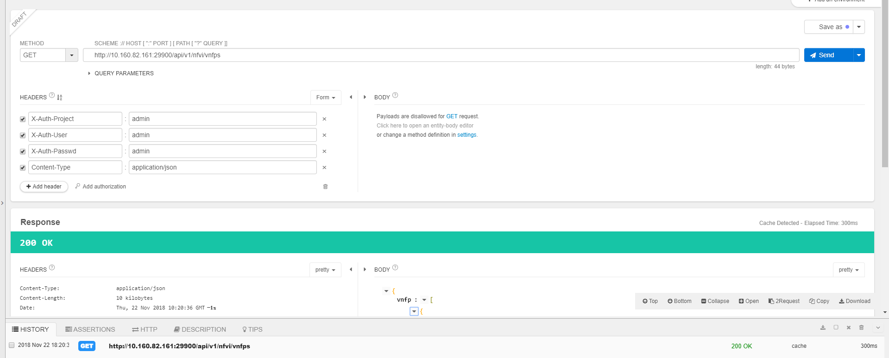
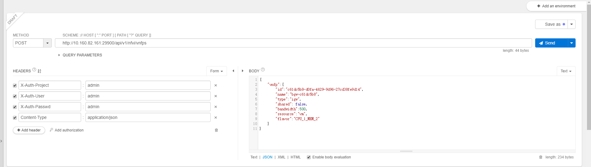
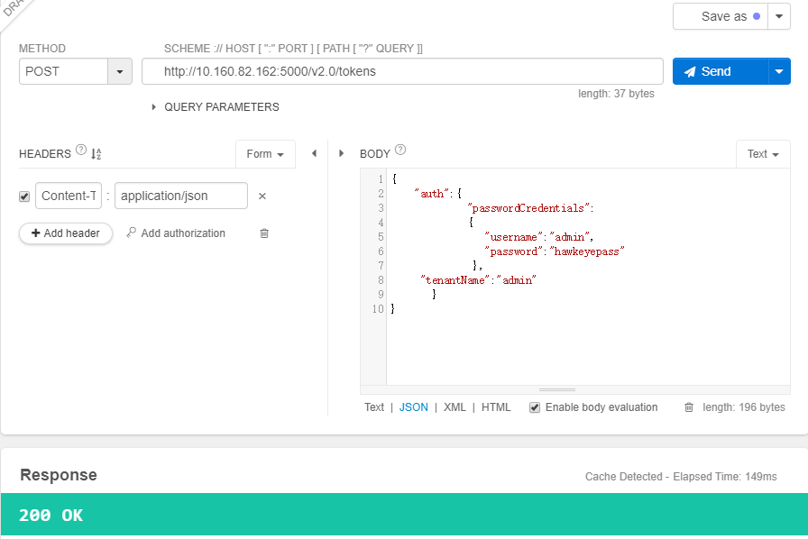
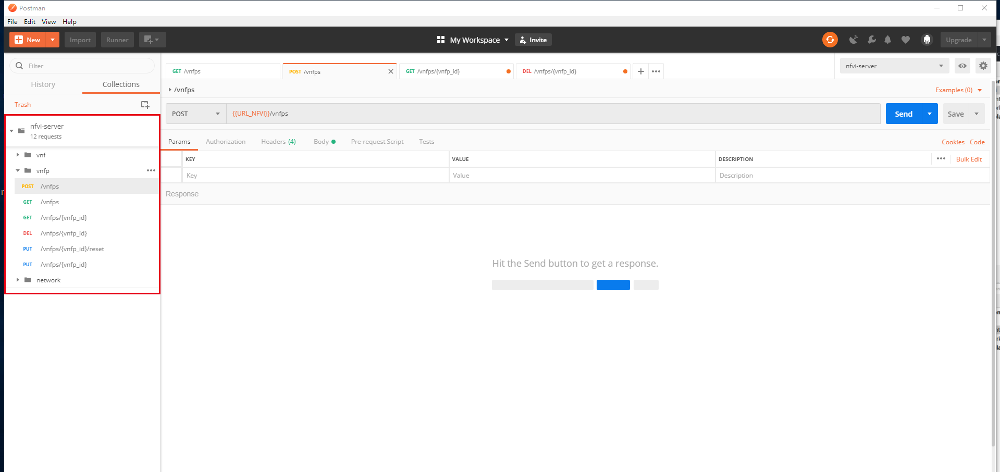
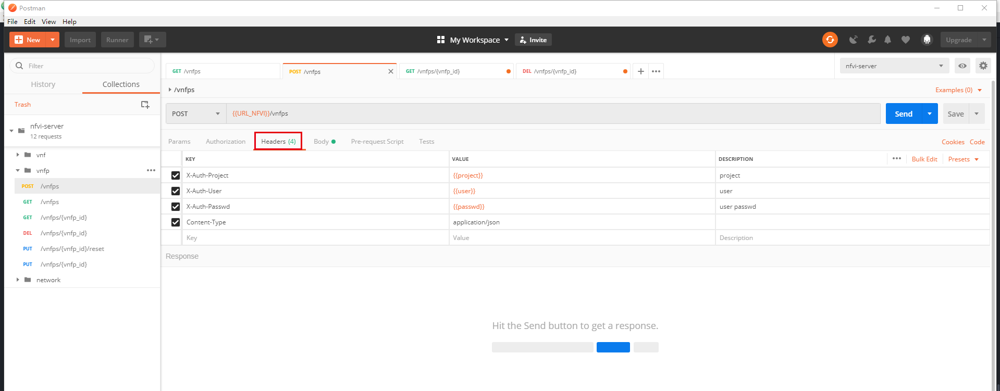
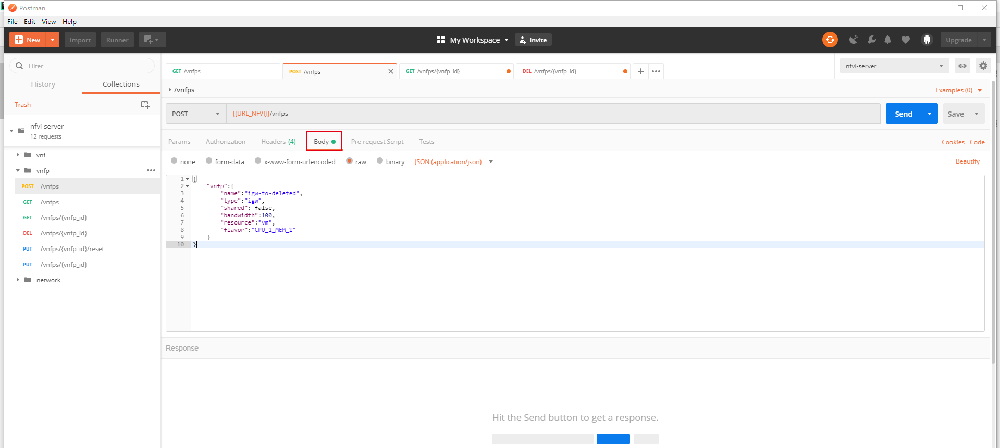
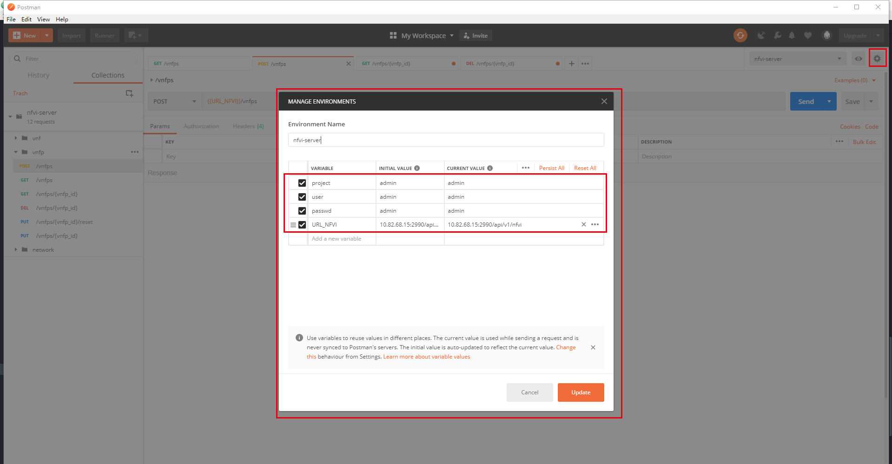

### postman学习
背景：在nfvi-server部署完成后，我们需要测试一些接口能够正常返回。这里可以用postman来做简要的检查。

## 接口文档规范
看nfvi-server对应的用户API文档。上面有请求api的一些规范。
- header部分：所有请求加header。header的内容包括所属的project名称，合法的用户名和密码，以及内容的类型content-Type。
- 每个api的描述分为URL,Request和Response。请求一般分为两种
  - URL主要分为两种类型，一种是GET请求，request为空，但可以加入查询的参数。另一种是POST请求，URL固定，request内容不为空。当然还有其他的，比如说DELETE请求，PUT请求等等。
  - request一般是json格式，也是KV格式，把我们要查询的字段信息放到request中
  - response是返回值。包括返回码以及一个json数据。会对返回的各个字段进行解释。

## postman使用
用户在开发或者调试网络程序或者是网页B/S模式的程序的时候是需要一些方法来跟踪网页请求的，一般我们用来模拟一些HTTP请求，然后测试相关的接口信息。
这里我用了chrome的插件安装的方式。

打开是这样的一个界面

- method选择包括GET, POST, DELETE, PUT等等请求，界面会根据method的改变而改变。
- URL只需要填入你需要的URL即可
- header有两种方式，一种是form的形式，也是KV格式，另一种是raw格式，只需要将header直接放到框框里即可。
- body，一般是针对post请求，需要放入request数据。这里也可以选框框中的格式，比如text，file， form等等。
- response，当我们发送了send之后，response处就可以看到返回信息。比如返回码，返回的json数据。

## 实例演示
1. 简单的GET请求

设置url为GET `http://{{nfvi-server}}:29900/api/v1/nfvi/vnfps`
设置header。
从response中获取结果。
```
{
"vnfp":[
{
"bandwidth": "500",
"flavor": "CPU_1_MEM_2",
"mgr_gateway": "10.160.82.254",
"mgr_netmask": "255.255.255.0",
"mgr_vip": "10.160.82.176",
"name": "bgw-c61dc5b8",
"resource": "vm",
"shared": false,
"status": "AVAILABLE",
"task_status": null,
"type": "bgw",
"vnfp_id": "c61dc5b8-d0fa-4629-9d96-27cd38fe9d14",
"vnfs_info":[{"az": "net-mgr-real-using_vnf0", "mgr_gateway": "10.160.82.254", "mgr_ip": "10.160.82.177",…]
},
{"bandwidth": "500", "flavor": "CPU_1_MEM_2", "mgr_gateway": "10.160.82.254", "mgr_netmask": "255.255.255.0",…},
{"bandwidth": "500", "flavor": "CPU_1_MEM_2", "mgr_gateway": "10.160.82.254", "mgr_netmask": "255.255.255.0",…},
{"bandwidth": "500", "flavor": "CPU_1_MEM_2", "mgr_gateway": "10.160.82.254", "mgr_netmask": "255.255.255.0",…},
{"bandwidth": "1000", "flavor": "CPU_1_MEM_2", "mgr_gateway": "10.160.82.254", "mgr_netmask": "255.255.255.0",…},
{"bandwidth": "1000", "flavor": "CPU_1_MEM_2", "mgr_gateway": "10.160.82.254", "mgr_netmask": "255.255.255.0",…},
{"bandwidth": "4000", "flavor": "CPU_1_MEM_2", "mgr_gateway": "10.160.82.254", "mgr_netmask": "255.255.255.0",…},
{"bandwidth": "500", "flavor": "CPU_1_MEM_2", "mgr_gateway": "10.160.82.254", "mgr_netmask": "255.255.255.0",…},
{"bandwidth": "500", "flavor": "CPU_1_MEM_2", "mgr_gateway": "10.160.82.254", "mgr_netmask": "255.255.255.0",…}
]
}
```
2. POST请求

```
{
    "bandwidth": "500",
    "flavor": "CPU_1_MEM_2",
    "mgr_gateway": "10.160.82.254",
    "mgr_netmask": "255.255.255.0",
    "mgr_vip": "10.160.82.176",
    "name": "bgw-c61dc5b8",
    "resource": "vm",
    "shared": false,
    "status": "AVAILABLE",
    "task_status": null,
    "type": "bgw",
    "vnfp_id": "c61dc5b8-d0fa-4629-9d96-27cd38fe9d14"
}
```

## 拓展1-postman+openstack
由于nfvi-server只是一个抽象层，你只需要将用户名、密码以及project名称发送给nfvi-server，他就会帮你申请token，组装URL，省去了很多的麻烦。但当我们想要直接对openstack发送请求时，需要先申请token，从第一次response中获取token的id，然后自己组装URL，再在token失效之前发送api请求给openstack，然后就可以实现了。



这里的返回码为200 OK，我们可以从后续的应答文档中获取返回信息。得到的返回值中就有token值。以及相关的adminURL, region, internalURL, id, publicURL等restful端点。

## 拓展2 - 提高postman的可用性
- 下载客户端的postman
- 导入已有的配置，或者自己添加请求的url、header、request body



- 添加环境变量。这样的好处在于当我们的服务器更换ip、用户名、密码的时候，我们无需去修改url、request body部分。只需要增加一个environment即可。

