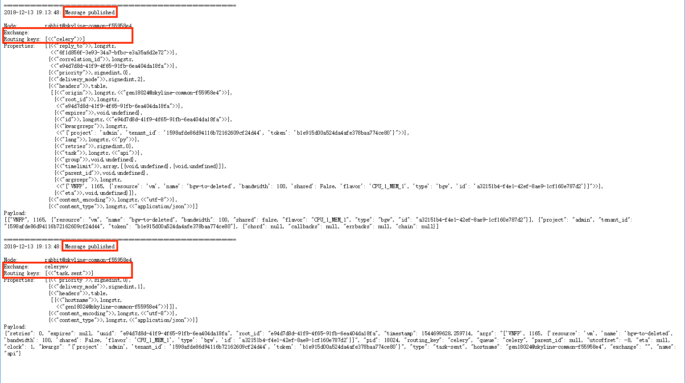

## Celery 在 Flask 框架中和 RabbitMQ 交互的代码梳理
### 代码逻辑梳理
- api, controller, worker与rabbitmq的关系

  - broker：消息传递的中间件。每当应用程序调用celery的异步任务的时候，会向broker传递消息，然后监听这个队列的celery worker将会取到消息，并执行这个任务。
  - backend: 通常程序发送的消息，发完就完了，可能都不知道对方是否接受了，为此，celery实现了一个backend，用于存储这些消息以及celery执行的一些消息和结果。

```python
# api发送到api_queue的任务
nfvi_app.send_task(
    name=API_TASK_NAME,
    args=api_args,
    kwargs=kwargs,
    #queue=CONF.api_queue
)
#controller的定义
class Controller(object):
    def __init__(self):
        self.app = app
        self.app.conf.update(worker_concurrency=CONF.controller.concurrency)
        #self.app.select_queues(CONF.api_queue)

    def start(self):
        self.app.worker_main(['controller'])
#controller发送到work_queue的任务
app.send_task(
  self.action,  # next_task_name,
  args,
  kwargs,
  countdown=next_task.get('countdown', 0),  # countdown
  queue=CONF.work_queue,
  link=worker_success.s(next_task, args, kwargs),
  link_error=worker_error.s(next_task, args, kwargs))

#worker的定义
class NfviWorker(object):
    def __init__(self):
        self.app = app
        self.app.conf.update(worker_concurrency=CONF.worker.concurrency)
        self.register_task()
        self.app.select_queues(CONF.work_queue)
```
- 状态图转换(以创建vnfp为例子)


当状态与状态之间的转换时，需要调用一个回调函数，用callback_execution来执行，然后获取next_task，然后执行start函数，然后在send_task，通过link、link_error来进行下一步的操作。link就是处理handler_success，再生成callback_execution; link_error是处理handler_error。
一般是通过`get_next_task`获取下一步的action, next, callback，进行状态转换
```
# next_task = {
#   "action": task action name,
#   "next": next status,
#   "callback": callback function,
#   "countdown": 0,
#   "max_retry": 1,
#   "re_entrant": False
#   }
```
在`nfvi.controller.Execution#get_next_task_args`和`nfvi.common.fsm.FSM#get_next`中可以看到
```python
#controller.py
def get_next_task_args(self):
    """get next task from fsm"""
    fsm = self.fsm_map[self.resource_type]
    LOG.debug("status=%s, spec=%s" % (self.resource.status,
                                      self.resource.spec))
    return fsm.get_next(self.resource.status, self.resource.spec)
...
#fsm.py
@classmethod
def get_next(cls, current_status, expected_status):
    next_state_task = cls.FSM.get(current_status, {}).get(expected_status)
    if not next_state_task:
        raise StatusError(
            "can not find next_task",
            current_status=current_status,
            expected_status=expected_status)
    return next_state_task

```

- 锁机制（class Execution）
  - 为什么需要锁
    如果任务发送频繁或者任务重复发送或者任务发送的次序有误，如果没有锁，woker就会争相去队列中拿这个任务，然后再执行，可能导致任务次序造成混乱，还可能修改其他worker完成的任务状态。加锁的操作就是保证这个状态图的转换按照我们设想的来变换。
  - 如何获得锁
    Exection.lock()申请锁，通过判断resource.worker_id是否与当前的worker_id一致来决定能否获得锁。如果一致，locked=True，上锁；否则locked为false。
  - 一般来说释放锁，有以下几种情况
      - 状态转换完成时，也就是expected_status与status一致。
      - callback函数调用失败，任务状态转换为ERROR
      - 任务retry超过一定次数
      - 超时机制
  - problem：
  通过看代码可以看到nfvi中的post_vnfp与post_acl其实是类似的。但是在cube中，将上锁的操作放在了post_acl函数中，而nfvi-server将上锁的操作放在了send_api_task中？
  防止acl访问的高并发。及时锁住。

```python
def lock(self):
    locked = False
    try:
        if self.check_locked():
            locked = True
        elif self.resource:
            return self.__lock_resource__()
    except Exception, e:
        LOG.error(e.message)
        LOG.error('error %s' % traceback.format_exc())
    return locked

def check_locked(self):
    return self.resource.worker_id == self.worker_id
```


## 与rabbitMQ中相关函数分析

- send_task函数参数分析
  - name: 任务绑定的名字
  - args：参数
  - kwargs：参数
  - countdown
  - queue：指定任务发送的队列.只有监听这个队列的worker才会收到信息。
  - link、link_error可以获取任务执行的结果，再去执行相关的操作。可以看到log日志中有对应的输出。
  

- linking(callbacks/errbacks)
  - celery支持连接任务，也就是说当一个任务完成之后，另一个任务可以接着做。这里link与link_error会将parent_task的结果作为一个参数值传入到child_task中。link把result作为传递，而link_error是以task_id作为传递。
  - **ps**: 在api发送任务的时候，我们只设置了name, args, kwargs，queue，也就是说api并不知道这个任务发送的结果，没有做任何处理。但是controller发送到worker，都有做link，worker的执行结果会返回到controller中，再执行后续的步骤。

```python
add.apply_async((2, 2), link=add.s(16),link_error=error_handler.s())
```
- on message callback
  - 耗时的任务可以用on_message来监控。
可以通过在任务中通过self.update_state来更新任务中间的状态，然后执行长时间的任务时，可以通过on_message来获取任务执行的状态

```python
@app.task(bind=True)
def hello(self, a, b):
    time.sleep(1)
    self.update_state(state="PROGRESS", meta={'progress': 50})
    time.sleep(1)
    self.update_state(state="PROGRESS", meta={'progress': 90})
    time.sleep(1)
    return 'hello world: %i' % (a+b)

def on_raw_message(body):
    print(body)

r = hello.apply_async()
print(r.get(on_message=on_raw_message, propagate=False))

{'task_id': '5660d3a3-92b8-40df-8ccc-33a5d1d680d7',
 'result': {'progress': 50},
 'children': [],
 'status': 'PROGRESS',
 'traceback': None}
{'task_id': '5660d3a3-92b8-40df-8ccc-33a5d1d680d7',
 'result': {'progress': 90},
 'children': [],
 'status': 'PROGRESS',
 'traceback': None}
{'task_id': '5660d3a3-92b8-40df-8ccc-33a5d1d680d7',
 'result': 'hello world: 10',
 'children': [],
 'status': 'SUCCESS',
 'traceback': None}
hello world: 10
```
- ETA and countdown
  - ETA其实是estimated time of arrival。预估一个结果返回的时间(不是确定)。这里我们一般用参数countdown或者eta来设置。举个例子，如果设置countdown=3, 也就是说我们需要至少3秒来得到返回的结果。比如说在`wait_volume_args`中，我们设置countdown=10，相对较长，因为创建volume的时间也比较久，避免多次无效的请求这个任务。

```python
result = add.apply_async((2, 2), countdown=3)
result.get() # this takes at least 3 seconds to return result
```
- expriration
这里expires参数定义一个额外的超时时间。当worker收到一个超时的任务，它会标记这个任务为revoked。
When a worker receives an expired task it will mark the task as REVOKED

- message sending retry。可以自定制一些超时机制。
  - max_retries: 在放弃任务之前重试的次数，如果不设置，会默认重试3次。如果设置为None，会重试无数次。
  - interval_start：第一次重试的时间。默认为0.
  - interval_step：在每次连续重试时，此数字将被添加到重试延迟（浮点或整数）。默认值为0.2。
  - interval_max：重试之间等待的最大秒数（浮点数或整数）。默认值为0.2。

- connection error handling
  - 当与rabbitmq的连接丢失或者连接没有初始化，会抛出`OperationalError`: kombu.exceptions.OperationalError: [Errno 61] Connection refused。如果你有retry次数，会在retry结束之后才抛出这个异常。我们可以通过try...except...来捕获这个异常。

```python
from celery.utils.log import get_logger
logger = get_logger(__name__)

try:
     add.delay(2, 2)
 except add.OperationalError as exc:
     logger.exception('Sending task raised: %r', exc)
```
- message acknowledgement
  - 消费者接到消息以后，需要给服务器发送一条确认命令，这个即可以在handleDelivery里显示的调用basic.ack实现，也可以在Consume某个队列的时候，设置autoACK属性为true实现。这个ACK仅仅是通知服务器可以安全的删除该消息，而不是通知生产者。如果消费者在接到消息以后还没来得及返回ACK就断开了连接，消息服务器会重传该消息给下一个订阅者，如果没有订阅者就会存储该消息。


### send_task分析
- 相关的概念

| 概念| 作用|
|---|---|
|connection|连接表示到消息代理的真实TCP连接.是RabbitMQ的socket连接，它封装了socket协议相关部分逻辑|
|channel|通道是其内部的虚拟连接(AMPQ连接)。这样，您可以在应用程序中使用尽可能多的(虚拟)连接，而不会使用TCP连接重载代理.|
|Exchange|消息交换机，根据routing key转发消息到对应的message queue中。它指定消息按什么规则，路由到哪个队列。几种类型，direct、fanout、broadcast
|Queue|消息队列载体，每个消息都会被投入到一个或多个队列。
|Binding|绑定，它的作用就是把exchange和queue按照路由规则绑定起来。
|Routing Key|路由关键字，exchange根据这个关键字进行消息投递。
|producer/publisher|消息生产者、发送者，为消息发送到exchange并指明routing key。
|consumer|消息消费者，从queue里面获取消息
- 这些概念如何连起来
  - 消息发布者 Publisher 将 Message 发送给 Exchange 并且说明 Routing Key。Exchange 负责根据 Message 的 Routing Key 进行路由，将 Message 正确地转发给相应的 Message Queue。监听在 Message Queue 上的 Consumer 将会从 Queue 中读取消息。
  - Routing Key 是 Exchange 转发信息的依据，因此每个消息都有一个 Routing Key 表明可以接受消息的目的地址，而每个 Message Queue 都可以通过将自己想要接收的 Routing Key 告诉 Exchange 进行 binding，这样 Exchange 就可以将消息正确地转发给相应的 Message Queue。


- 三种主要的exchange模式

|模式|描述|
|---|---|
|direct|一对一的关系。所有发送到 Direct Exchange 的消息被转发到 RouteKey 中指定的 Queue.RouteKey 必须完全匹配，才会被队列接收，否则该消息会被抛弃。|
|fanout| 相当于广播。所有发送到Fanout Exchange 的消息都会被转发到与该 Exchange 绑定（Binding）的所有 Queue 上，无需处理routing key，先将exchange与队列绑定|
|topic   |模糊匹配。所有发送到 Topic Exchange 的消息被转发到所有关心 routing Key 中指定 Topic 的 Queue 上，Exchange 将 RouteKey 和某 Topic 进行模糊匹配。队列是绑定到一个topic上|

- send_task相关代码。位置`celery.app.base.Celery#send_task`

  - message=amqp.create_task_message(...) 创建一个消息。
  - 当connection不为空的时候，producer = amqp.Producer(connection,auto_declare=False) 创建一个消息生产者。
  - self.backend.on_task_call(P, task_id) 将producer、task_id写入backend中
  - amqp.send_task_message(P, name, message...) 发送任务到队列中
  - 根据task_id获取result并返回。link， link_error就是获取这个result结果。

- amqp.send_task_messge(...)`C:/Users/huangguoyan01/.PyCharm2018.3/system/remote_sources/1567160488/-2090441442/celery/app/amqp.py:487`
  - 核心函数：self._ create_task_sender()里面的send_task_message
 producer.publish指定message、exchange、routing_key、header等等，将消息发送到特定的exchange中。
   1. 通过self.connection.ensure确认connection是可连接的。
   2. 连接成功，利用channel.basic_publish()发送消息到exchange中。我们在amqp中可以获得ret这个变量。最终这个变量会返回给celery。send_task函数中通过task_id来获取这个task的任务结果。
   3. 连接不成功，会进行重试。

  ```
  #amqp.py中的send_task_message函数
  ...
  ret = producer.publish(
                body,
                exchange=exchange,
                routing_key=routing_key,
                ...
            )
    ...
  # messaging.py中的_publish函数
  return channel.basic_publish(
            message,
            exchange=exchange, routing_key=routing_key,
            mandatory=mandatory, immediate=immediate,
        )
  # channel.py中的_basic_publish函数
    return self.send_method(
                      spec.Basic.Publish, argsig,
                      (0, exchange, routing_key, mandatory, immediate), msg
                  )
  ...
  # connection.py
    conn.frame_writer(1, self.channel_id, sig, args, content)

  ```
  - 消息publish部分(其他)
  celery.pidbox和celeryev都是celery内部用来发送event和管理其他队列的队列。
  在看代码的时候，api通过send_task发送一个任务，会message publish两次。第一次是我们要发送的那个任务，第二次是一个event的消息发布。
  ```
  evd.publish('task-sent', sent_event,
                            producer, retry=retry, retry_policy=retry_policy)
  ```

  
  event会发送到一个celeryev的exchange中。是topic类型。另外rabbitmq还会用clery.pidbox来管理worker。它是一个fanout类型的exchange。  
  
### 配合日志来看整个过程
复现的过程：通过rabbitmq自身带的监控，访问localhost:15672，安装tracing插件，跟踪日志的发布。

- 看publish(消息发布)的过程-只运行api，不运行controller和worker，这样api发送的任务就会停留在队列(celery)中。


- 看received(消息消费)的过程-只运行api，运行controller，不运行worker，这样controller会拿走api发送的任务，但是controller发送的任务会停留在队列(work_test)中。


- 最后运行worker。这样在队列里面的任务都会运行。


- 调试过程的一些记录


