## 备盘池基本功能测试
主要需要测试定期创盘与同步的功能。

- 清空备盘池数据库表
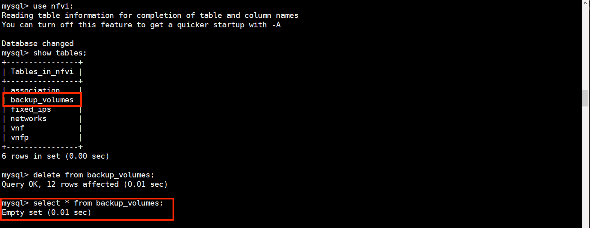
- 启动进程。这里根据设置的参数，每小时备盘一次，执行时间在0时刻；每小时同步一次，执行时间在30分时执行。选择所有类型的盘都备两份。
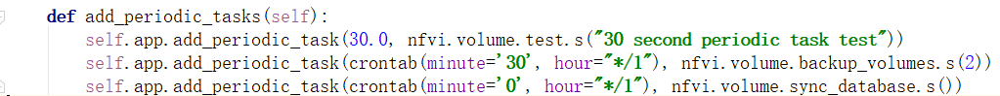
-  到点观察数据库是否新增数据。备盘操作是否执行。
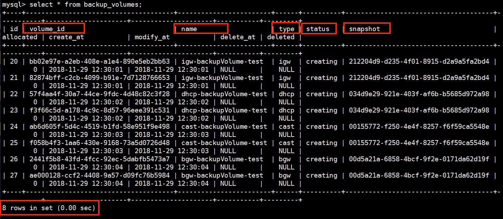
- 到点观察数据库是否更新数据。同步操作是否执行。
我们与openstack的数据进行同步，需要修改的数据包括status，以及确保数据库中的volume都在openstack中存在。
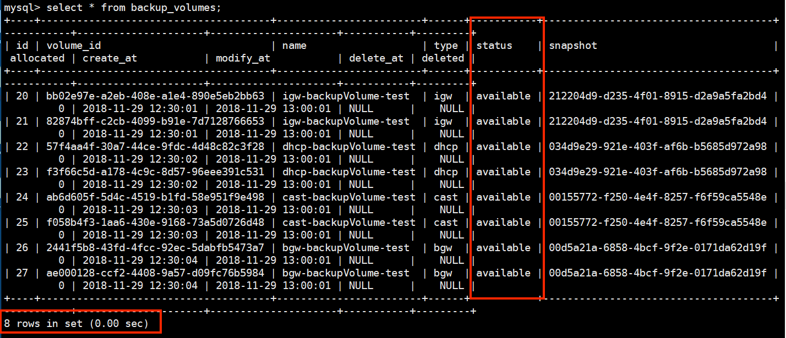
-  周期任务的执行时间是否符合预期
  - 备盘操作
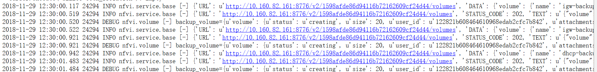
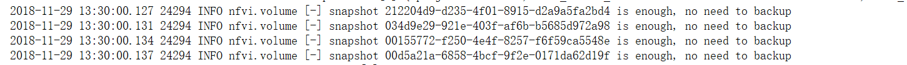
  - 同步操作
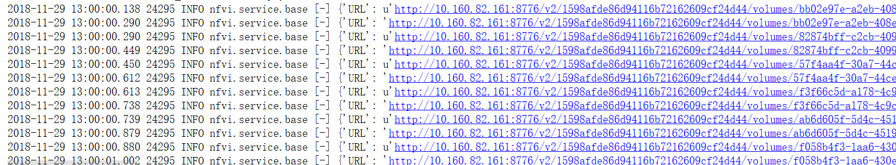
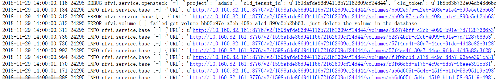

- openstack中删除一条volume信息。观察同步，数据库变化，以及定期备盘池进程是否补充备盘池。
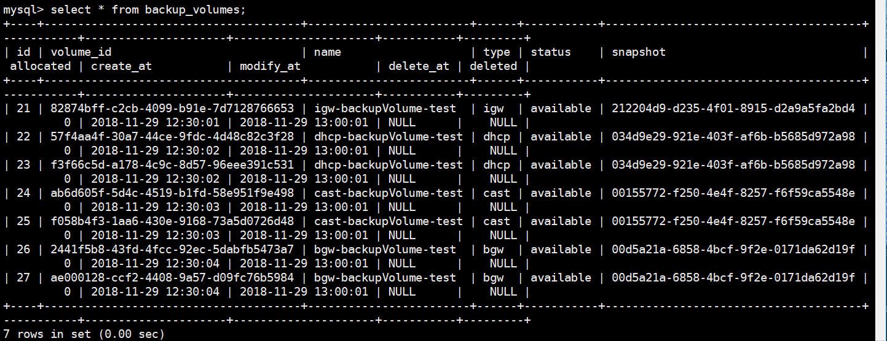
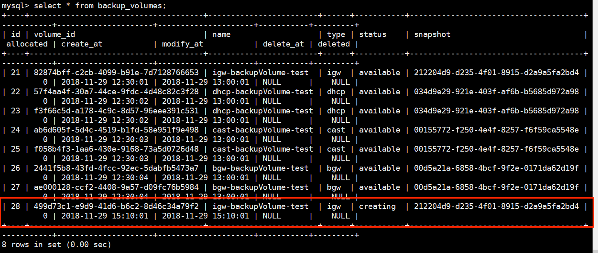


|测试操作|结果|是否符合预期|
|--|--|--|--|
|将数据库表清空，模拟首次备盘|数据库表中新增nums*4条数据，备盘池中新增4种类型的volume，status设置为creating|是
|备盘池的volume已经满足了预期需求且无人使用备盘，再次备盘|数据库表中不会新增数据，备盘池无变化|是
|有人使用了备盘，再次备盘。将数据库中某一个volume的allocated设置为true| 数据库表新增数据，新建备盘，补充备盘池|是
|当openstack无变化，同步数据库信息|数据库表与openstack中的对应volume同步数据，主要更新的是status、allocated字段 |是|
|当openstack变化，同步数据库信息(这里的变化包括 将某一条volume删掉，volume的status为error，创盘失败，volume已经被占用)|数据库表会删除不存在openstack的数据，或者更新allocated、status字段 |是
|周期任务执行|执行的时间分别每小时的0分和30分 |是


测试并发请求的过程中出现的两个问题，记录一下问题分析与解决方案。
1. 并发性请求申请vnfp的时候，数据库出现并发访问，
 - **分析**：因为访问相关数据库表时没有加锁，因此可能会存在不同的vnf分配到同一个备盘池的volume。同理，分配fixed ip的时候也因为没有考虑到并发问题，不同的vnf会分配到同一个fixed ip。
 - **解决方案**，利用`.with_for_update()`来锁住数据库表，防止并发访问数据库，读到脏数据或者写入脏数据。

 ```
 #nfvi/command/vnfp.py:254
 backup_vols = session.query(Backup_volumes).filter(
            and_(Backup_volumes.type == vnf_type, Backup_volumes.status ==
                 "available")).with_for_update().all()
 #nfvi/server/vnfp.py:159
 fixed_ips = current_session.query(Fixed_ips.address). \
                filter_by(network_id=netid). \
                filter_by(allocated=0). \
                filter_by(reserved=0).with_for_update(). \
                limit(ip_num)          
 ```
2. 首次备盘的时候，当创盘数量比较多的时候，会导致创盘失败率增加
  - **分析**：因为没有控制创盘任务的速率，直接将所有的创盘请求发送给cinder，容易压垮cinder，导致创盘失败率提高。
  - **解决方案**：控制任务发送的速率，利用`sleep(second)`人为增加创盘的任务间隔。
  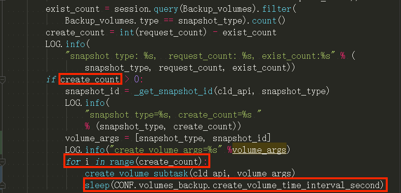
  - 测试方案：
  此时备盘任务启动(设置备盘时间周期为3min)，需要创建两块igw和两块bgw的volume。我们可以看到创盘的请求是每分钟发起一次。
  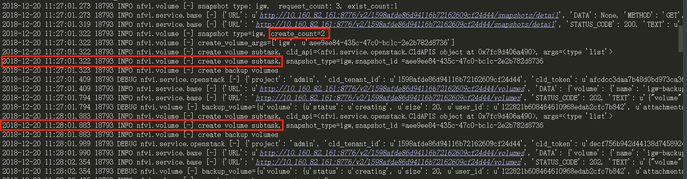
  当创建到第三块盘的时候，因为备盘任务的周期到了，需要执行一次备盘任务。但是检测到上一个备盘任务还没结束，因此跳过了这次的备盘任务。
  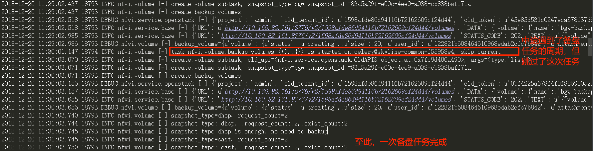
