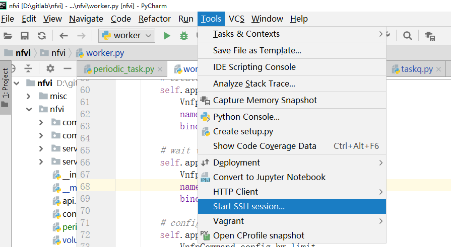

开发环境的配置工作主要是在pycharm中设置远程调试。下面记录一系列的操作。
这里记录的是windows下的开发环境搭建。

1. 安装pycharm
2. 从gitlab上下载源代码。要把自己的公钥放到gitlab上，选择SSH下载的链接。
3. 配置SFTP。Tools -> Deployment -> configuration

需要填写两部分信息，第一部分是connection，第二部分是mapping。connection主要是填写远程服务器的登陆信息，我们选择左上角的`+`，新增一个deployment。选择SFTP类型，填写登陆信息。这里可以点击`Test Connection`来测试。但是需要注意的是你在远程主机需要有登陆权限，添加了用户，不然还是会登陆不进去。

 LocalPath填写的是你的项目工程所在的路径。mapping主要是填写你代码需要放置的位置。一般是RootPath/Deployment Path。因此要结合上一个图片中的RootPath。

然后我们可以创建SSH session。在terminal中可以看到新建的窗口，我们可以免密码登陆到远程主机，执行相关的操作。

4. 然后我们选择interpreter。首先在远程主机上创建虚拟环境。
```
virtualenv -p python venv
```
5. 通过File->Setting->Project interpreter->Add

一般其他操纵系统或者旧版的pycharm都是add remote, 但是我找了好久都没有。发现新版本(2018.6)变成了SSH interpreter这个选项。我们只需要配置即可。

这里的interpreter选择第四步创建的虚拟环境，然后同步的folder可以选择自己想要同步的位置。然后点击finish就大功告成了。


6. 配置运行命令。nfvi要配置三个，分别是controller, api, worker


