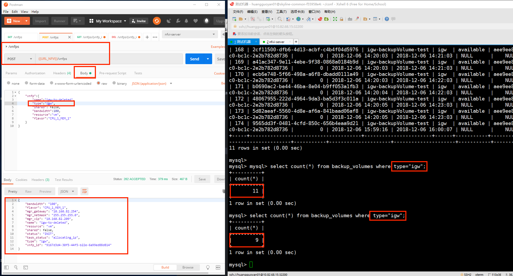
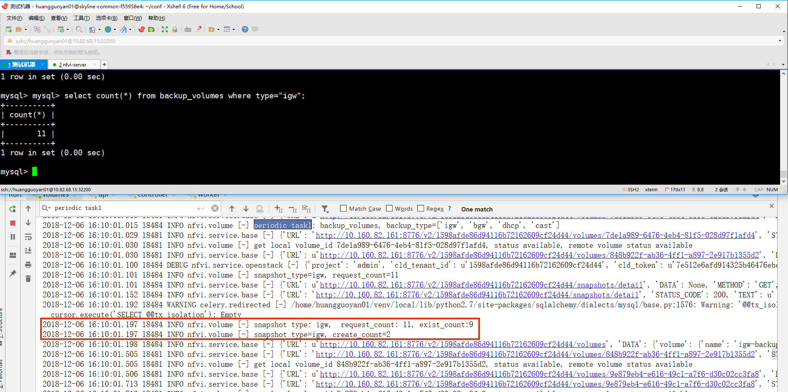

## 自测文档
1. 测试重叠的周期任务
某一个任务设置5s执行一次，执行过程中设置任务内容为sleep(60)，模拟忙碌状态.观察这个任务的执行周期与清空。发现重叠任务时不执行操作。

2. 测试使用备盘池的volume，并创建vnfp
利用postman发起创建vnfp的post请求。观察数据库`vnfp`，`backup_volume`变化, 通过GET请求获取新增的vnfp的状态，看能否正常创建。

3. 测试周期性备盘
观察数据库中`backup_volume`变化。

