## 使用方法
### 数据库新增表`backup_volumes`。
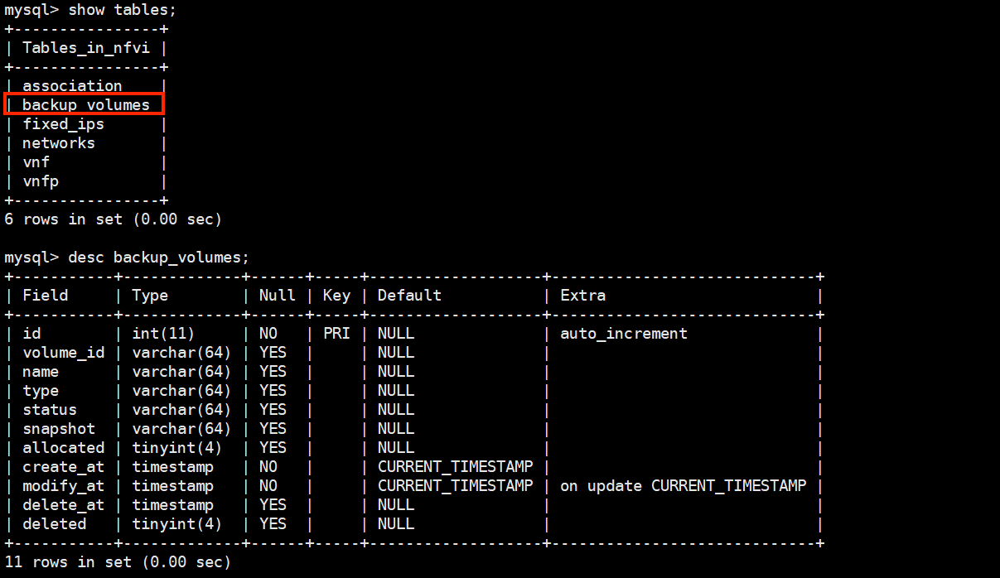

### 配置文件新增项
```
[DEFAULT]
...
volume_queue=volume_test

[volumes]
concurrency=10

[volumes_backup]
backup_nums_igw_bgw=11
backup_nums_dhcp_cast=2
volume_backup_types=igw,bgw,dhcp,cast
backup_frequency_minute = 10
check_state_frequency_minute = 5


[auth_args]
auth_project=admin
auth_user=admin
auth_passwd=admin
```

### 启动备盘池进程。
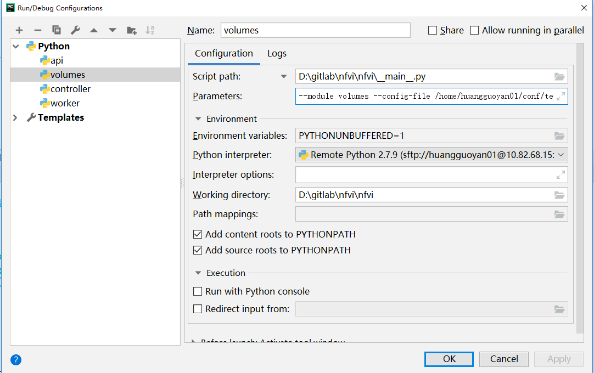

## 自测报告
- 测试使用备盘池的volume，并创建vnfp
利用postman发起创建vnfp的post请求。观察数据库`vnfp`，`backup_volume`变化, 通过GET请求获取新增的vnfp的状态，看能否正常创建。
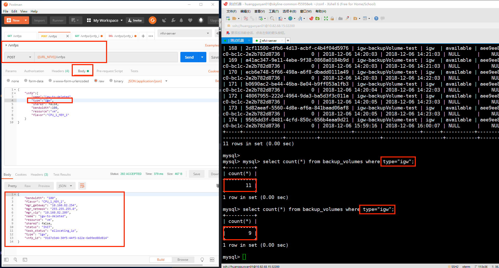


- 看nfvi中备盘的变化(是否更新volume_name)
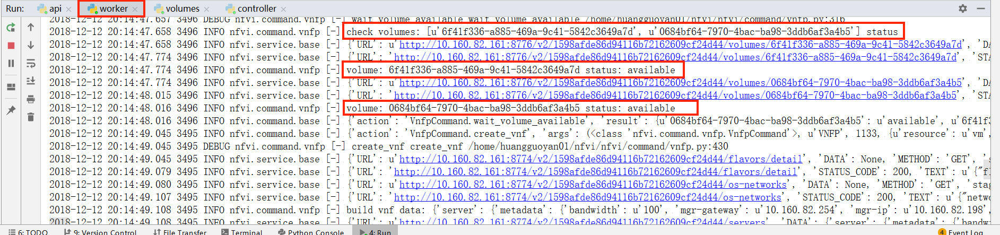
备盘从available变成了in-use，并且volume_name改变了。
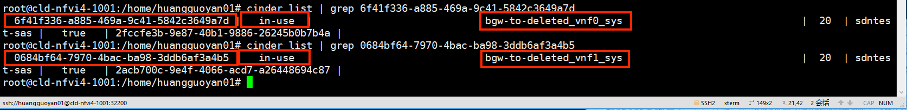


- 测试周期性备盘
观察数据库中`backup_volume`变化。
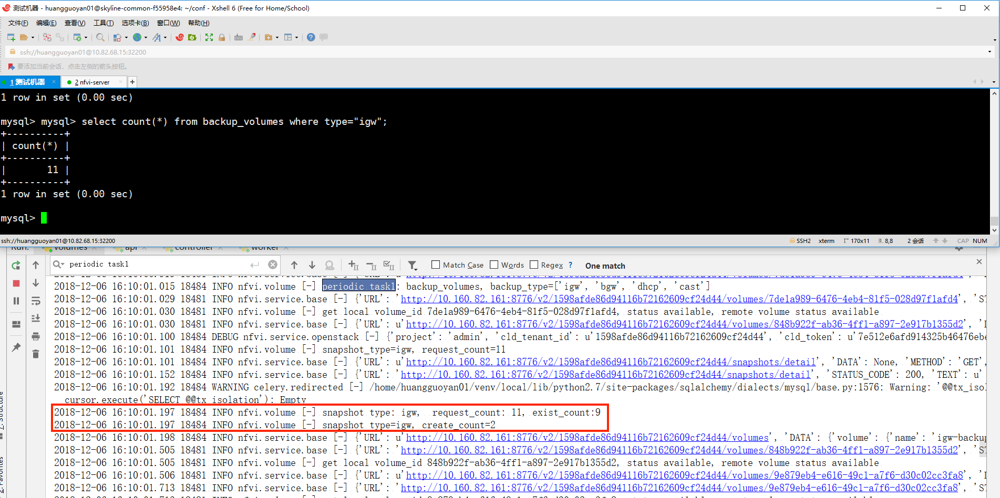

- 看备盘、同步任务的执行周期是否符合预期
备盘任务的周期设置为每10分钟一次，同步任务的周期设置为1分钟一次。
```python
nfvi_app.conf.beat_schedule = {
    'backup_volumes': {
        'task': 'nfvi.volume.backup_volumes',
        'schedule': crontab(
            minute='*/' + CONF.volumes_backup.backup_frequency_minute),
        'options': {'queue': CONF.volume_queue}
    },
    'check_volume_state': {
        'task': 'nfvi.volume.check_volume_state',
        'schedule': crontab(
            minute='*/' + CONF.volumes_backup.check_state_frequency_minute),
        'options': {'queue': CONF.volume_queue}
    },
}
```
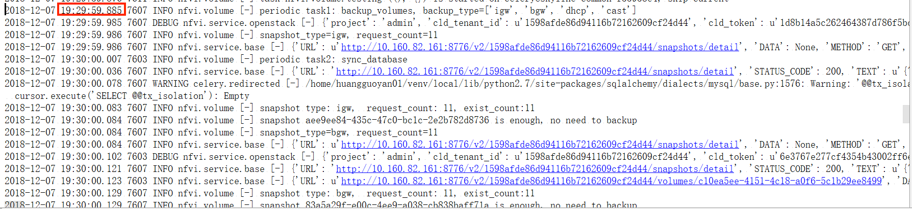
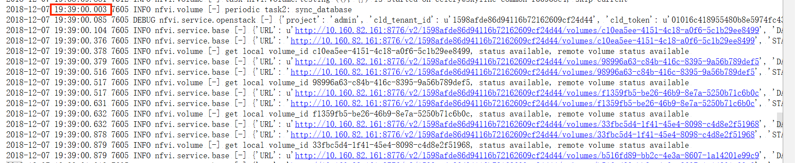
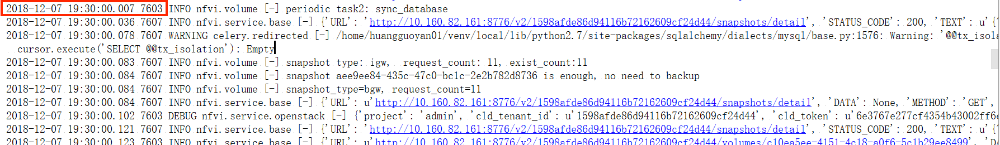
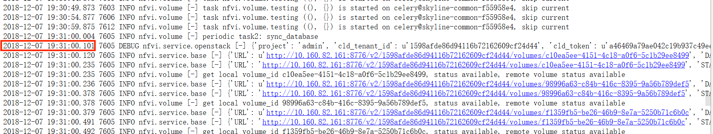

- 测试重叠的周期任务。设置任务间隔很短，但是任务执行时间比较长。
某一个任务设置5s执行一次，执行过程中设置任务内容为sleep(60)，模拟忙碌状态.观察这个任务的执行周期与清空。发现重叠任务时不执行操作。
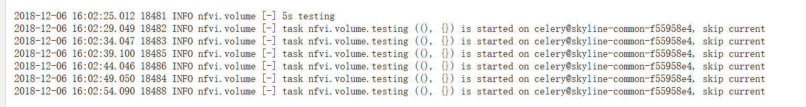

- 更新volume状态
新创建的volume的状态为creating。通过定时任务`check_volume_status`,更新volume状态。
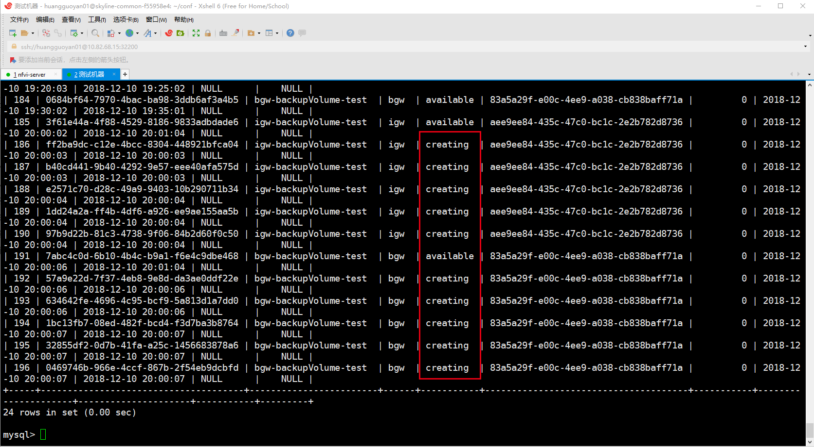
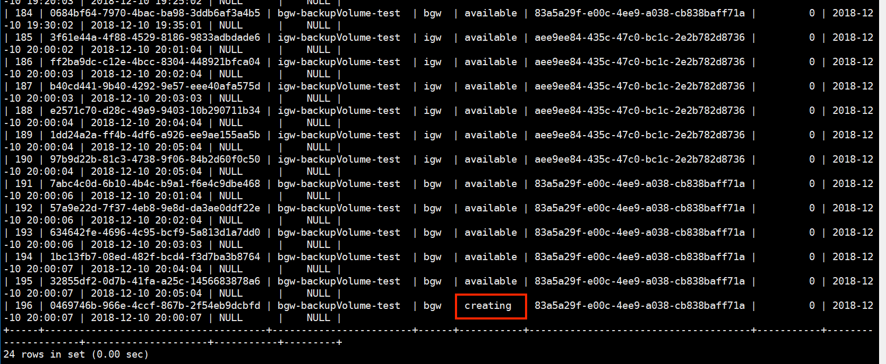
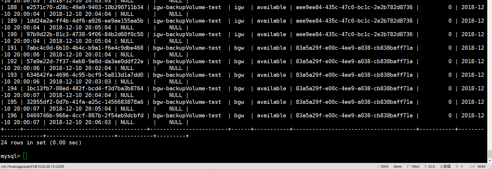

- 删除使用了备盘的vnfp
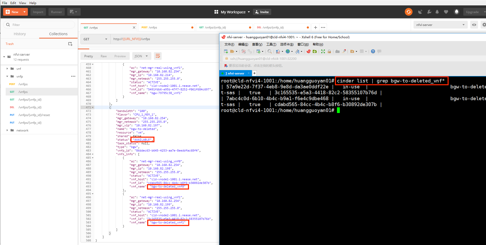
删除这个vnfp，对应的volume也会随之删除。
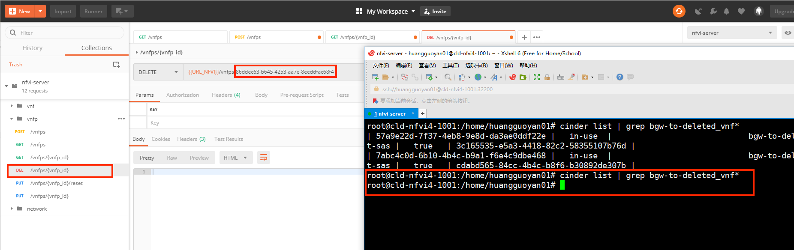
## 测试用例设计

|测试操作|结果|
|--|--|--|--|
|将backup_volumes数据库表清空，模拟首次备盘|数据库表新增数据，根据配置文件创建volume|
|备盘池的volume已经满足了预期需求且无人使用备盘，再次备盘|数据库表中不会新增数据，备盘池无变化|
|有人使用了备盘，再次备盘。|数据库表新增数据，新建备盘，补充备盘池|
|check_volume_state：检查所有数据库中状态为creating的volume的状态变化|数据库表会更新volume状态，如果不是creating，available就从数据库中删除 |
|周期任务执行，看运行的时间是否符合预期，这里频率使用默认值。|每10分钟执行backup_volume任务，每5分钟执行check_volume_state任务 |
|周期任务重叠|判断为同一个周期任务则不执行|
|创建vnfp的时候备盘的volume不足时|创建vnfp成功，正常的创建顺序，需要等待创盘时间|
|创建vnfp的时候备盘的volume足够|创建vnfp成功，无需等待创盘时间。创建vnfp的时候选择备盘，对备盘进行修改名称，并且从数据库表中删除该条目。|
|删除对应的vnfp|删除vnfp成功，流程无改变，直接删除对应的volume|
|修改配置文件中的参数，看是否生效|对应不同的参数设置，备盘频率，备盘个数等等，看实际备盘的动作，与配置文件一致|
